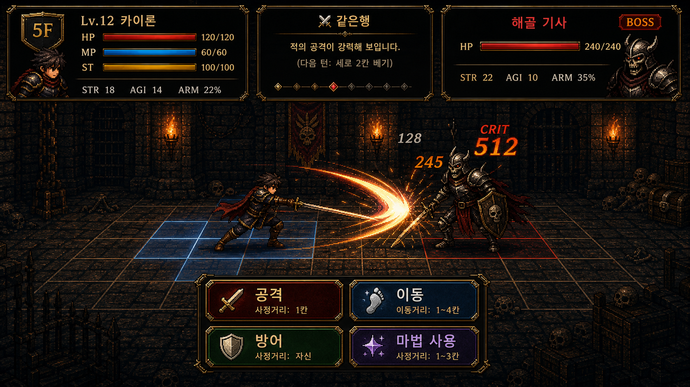

# SwordMastersAscent (T of Sword) — Game Design Document

- 문서 유형: 게임 기획서 (GDD)
- 문서 버전: 2.1
- 프로젝트 버전: 1.7.1 (`package.json` `version` 필드, 사실 검증됨)
- 최종 수정: 2026-09-11 (KST)
- 근거 신뢰도: 높음 — 이번 회차는 실제 코드 파일(`src/lib/gameData.ts` 1882줄 전체, `src/lib/swordSchools.json`, `src/components/SwordmastersAscent.tsx`)과 테스트 파일(`tests/combat-feedback.test.cjs` 등)을 직접 열람하여 검증함. 이전 버전(2.0)에서 발견된 두 건의 수치 오류(오디오 파일 개수, 전투 피드백 테스트 개수)를 정정함.
- 범례: **[검증됨]** = 코드/테스트에서 직접 확인, **[미검증]** = 파일 존재는 확인했으나 본문 세부 로직까지 확인하지 못했거나 코드에서 근거를 찾지 못함 (절대 창작하지 않음), **[제안]** = 이번 문서에서 새로 제안하는 설계 아이디어(구현되지 않음)

이전 버전(문서 버전 1.0, 2026-06-30 이전)은 Read 도구 제한으로 대부분 [제안] 처리되어 있었다. 이번 개정은 실제 소스 코드를 근거로 재작성한 것이며, `gameplay_preview` 상대 경로 참조가 있었다면 보존한다(이번 회차 원본에는 해당 참조가 없어 추가하지 않음).

---

## 1. 문제 정의

기존 문서(v1.0) 및 `docs/next_improvement_instruction.md` [검증됨: 파일 열람]에 따르면, 이 프로젝트가 실제로 다룬 핵심 문제는 다음과 같다:

- 액션 전투에서 공격 예비동작(windup), 명중 결과, 회피 성공, 피격 반응이 한 번의 인지 동작으로 구분되지 않아 전투 판단이 늦어지는 문제 [검증됨: `docs/next_improvement_instruction.md` Instruction 1, `tests/combat-feedback.test.cjs`].
- 첫 3분 루프에서 다음 등반 목표, 현재 보상 선택지, 성장 선택의 결과가 한눈에 보이지 않는 문제 [검증됨: `next_improvement_instruction.md` Instruction 2].
- 검술 유파(빌드) 선택이 실제 전투 스타일 차이로 체감되지 않을 수 있다는 리스크 [검증됨: `sword-schools.test.cjs` 존재 및 `swordSchools.json`/`createPlayer()` 코드로 실제 능력치·인벤토리 분기 확인].

## 2. 페르소나 (주 페르소나)

이름: 김도현, 28세, IT 스타트업 백엔드 개발자 [기존 v1.0 문서 계승, 설계 산출물]. 퇴근 후 30분~1시간의 짧은 세션으로 액션 게임을 즐기며, 반복 전투의 타격감과 눈에 보이는 성장(칭호·유파 숙련도)을 중시한다.
- 이 페르소나의 실제 플레이테스트 운영 여부는 `docs/persona_playtest_feedback.md` 파일 존재로 시사되나, 본문 내용은 이번 회차 조사 범위 밖이라 **[미검증]**으로 남긴다.
- 맥락: 포터블 실행 파일(`SwordMastersAscent_v{version}_portable.exe`, `package.json`의 `portable.artifactName` [검증됨])로 배포되는 PC 단독 실행형 로그라이트 액션. 별도 설치나 로그인 없이 즉시 실행 가능.

## 3. 코어 루프 (X → Y → X)

**선택(X) → 판정/전투(Y) → 성장/보상(X)** 순환:

1. 플레이어가 층에 입장해 적과 조우한다.
2. 매 턴 메인 행동(공격/이동/방어/마법 사용/아이템 사용, 5종)과 서브 행동을 선택한다 — 이는 적의 예측 정보(확률 힌트)와 가위바위보식 완전 카운터 관계(`PERFECT_COUNTER`) 위에서 이루어지는 판단이다 [검증됨: `gameData.ts` `SUB_ACTIONS`, `PERFECT_COUNTER`, `generateEnemyIntent`].
3. 속도 주사위 → 힘싸움 주사위 → (마법 시전 시) 마법 성공 주사위 순으로 3단계 판정을 거쳐 피해/회피/부상이 결정된다 [검증됨: `resolveTurn()`].
4. 승리 시 장비/아이템/칭호 보상을 받고, 다음 층으로 올라가거나 층 이벤트(쉼터/행상/폐허/맹세)를 만난다 [검증됨: `getRewardEquipment`, `generateCombatTitles`, `ITEM_REWARD_POOL`, `generateFloorEvent`, `shouldTriggerEvent`].
5. 강화된 상태로 다시 다음 적과 조우한다(코어 루프 1로 복귀). 사망 시 레거시 캐릭터로 남아 이후 회차에 유파 이름이 붙은 유령으로 재등장할 수 있다 [검증됨: `generateEnemy()`의 `floorGhosts`/`legacyCharacters` 처리].

## 4. MVP 가설

- 가설 1: 완전 카운터 기반 서브 액션 선택(가위바위보 확장판)과 3단계 주사위 판정을 결합하면, 무작위성과 플레이어 판단력이 공존하는 짧은 전투 루프가 만들어진다 → 검증 방법: `tests/*.test.cjs` 단위 테스트 및 실제 플레이 세션 관찰 [검증됨: 로직은 코드로 확인, 실제 플레이테스트 결과 수집 여부는 **미검증**].
- 가설 2: 전투 피드백을 판정 단계별(예비동작/명중/회피/피격)로 분리하면 타격감 인지가 향상된다 → 검증 방법: `tests/combat-feedback.test.cjs` (11개 테스트, `getCombatFeedbackCues` 함수 단위 검증) [검증됨: 테스트 코드 직접 열람, 테스트 개수 재확인].
- 가설 3: 5개 검술 유파가 시작 능력치/인벤토리/마법 슬롯을 다르게 하여 실제로 체감 가능한 빌드 차이를 만든다 → 검증 방법: `tests/sword-schools.test.cjs` + `createPlayer()` 분기 로직 [검증됨].

## 5. 참고 분석 (레퍼런스)

이번 조사에서 프로젝트 내부 문서 중 외부 레퍼런스 게임에 대한 직접적 근거 파일을 찾지 못했다. 과거 v1.0 문서의 "소울라이크/하이브리드 액션 RPG" 레퍼런스는 **[미검증, 원문서에도 제안으로 표기되어 있었음]**이므로 이번 문서에서는 신규 창작 없이 다음만 명시한다:
- `docs/superpowers/plans/` 하위에 실제 구현 계획 문서 5종이 존재한다: `2026-04-28-combat-depth.md`, `2026-04-28-floor-events.md`, `2026-04-28-meta-progression.md`, `2026-04-29-injury-system.md`, `2026-04-29-vfx-enhancement.md` [검증됨: 파일 존재]. 이 문서들의 세부 내용(적용 교훈 단계)은 이번 조사 범위에서 본문까지 열람하지 않았으므로 세부 인용은 **[미검증]**.
- `docs/superpowers/specs/2026-05-13-combat-hud-redesign-design.md`, `docs/superpowers/plans/2026-05-14-combat-hud-redesign.md` 존재 확인 [검증됨: 파일 존재], 세부 내용 **[미검증]**.

## 6. 디자인 필라

1. **완전 카운터 기반 판단** — 모든 서브 액션은 정확히 하나의 완벽 카운터를 가진다(`PERFECT_COUNTER`, 21개 서브 액션 매핑 전체 검증) [검증됨].
2. **3단계 주사위 판정으로 만드는 불확실성 속 실력** — 속도 주사위(선제/회피) → 힘싸움 주사위(피해 배율) → 마법 주사위(2d6, 6 이상 성공/10 이상 강화) [검증됨: `resolveTurn`].
3. **포지션 + 행(Row) 이중 그리드 전투** — 좌우 거리(1~5칸)와 상하 3행(1~3, 기본 2)을 동시에 관리해야 공격이 명중한다(공격은 동일 행에서만 명중, 마법·투척은 행 무관) [검증됨: `isAttackHitByRow`, `calcNewRow`, `COMBAT_ROW_MIN/MAX`].
4. **누적되는 성장과 상흔(부상)** — 큰 피해를 받으면 확률적으로 팔/다리/몸통 부상이 생겨 다음 전투 능력치에 지속 페널티를 준다 [검증됨: `rollInjury`, `getInjuryStatMult`, `getBodyInjuryStaminaDrain`].
5. **유파 선택에 따른 시작 빌드 분기** — 5개 유파가 능력치·인벤토리·마법 슬롯을 바꾼다 [검증됨].

## 7. 컴포넌트 표

### 구성요소

이 표는 게임의 핵심 구성요소를 정리한다.

| 컴포넌트 | 역할 | 플레이어 선택지 | 입력→판단→피드백 | 구현 상태 |
|---|---|---|---|---|
| 유파 선택 (StatRollScreen 이전 단계) | 시작 빌드 결정 | 균형검/암영검/비전검/주술검/철벽검 중 1개 | 이름 입력→유파 카드 확인→선택 즉시 보너스 요약 표시(`bonusSummary`) | 구현됨 [검증됨] |
| 능력치 굴림 (StatRollScreen) | 시작 능력치 확정 | 굴림 결과 확인 후 진행 | 굴림→수치 표시→하이스코어 보너스(`highScore*0.1`) 안내 문구 | 구현됨 [검증됨] |
| 메인/서브 행동 선택 (CombatStep) | 턴별 전략 입력 | 5개 메인 행동 × 각 2~6개 서브 행동 | 적 의도 확률 힌트 확인→서브 선택→주사위 결과·데미지·상태이상 텍스트 피드백 | 구현됨 [검증됨: `CombatStep` 타입 `select_main→select_sub→rolling→result`] |
| 층 이벤트 (FloorEvent) | 루프 사이 리스크/리턴 선택 | 쉼터(휴식/단련/부상치료/무시), 행상(민첩/방어구매/무시), 폐허(도박2종/무시), 맹세(힘/민첩/거부) | 선택→즉시 apply()로 스탯 변화→다음 층 진입 | 구현됨 [검증됨: `generateFloorEvent`] |
| 보상 화면 (reward phase) | 전투 후 성장 | 장비 1개 + 아이템 보상 + 칭호 3개 중 선택 | 승리→즉시 보상 후보 3종 롤→선택 반영 | 구현됨 [검증됨: `getRewardEquipment`, `ITEM_REWARD_POOL`, `generateCombatTitles`] |
| 튜토리얼 (TutorialScreen) | 온보딩 | 세계관 2단계 + 시스템 가이드 N단계 진행 | 스텝 진행바(2칸 세계관/파랑 시스템 칸)→다음 단계 | 구현됨 [검증됨: `TutorialScreen`, `TUTORIAL_STEPS`] |
| 세이브 슬롯 (StartScreen) | 진행 저장/이어하기 | 3개 슬롯 중 선택 | 슬롯 선택→저장된 층수/하이스코어 표시 | 구현됨 [검증됨: `SAVE_SLOT_KEYS` 3개, `saveGame/loadGame`] |
| 언락 조건 관리 | 메타 진행 게이팅 | 5개 언락 항목 확인 | 층 통과/보스 처치 수 누적→조건 충족 시 해금 | 구현됨 [검증됨: `UNLOCK_CONDITIONS`, 컴포넌트 내 `floor>=5/10/20`, `bossCount>=1/5` 분기] |

## 8. 콘텐츠 (코드로 검증된 수치만 기재)

### 8.1 검술 유파 (5개) [검증됨: `swordSchools.json` + `tests/sword-schools.test.cjs`]
| id | 이름 | 보너스 요약 | 계승명 |
|---|---|---|---|
| default | 균형검 | 기본 능력치 유지 | 균형검의 검혼 |
| assassin | 암영검 | 민첩 +10, 투척 단검 2개로 시작(`throwing_dagger`×2 + 기본 치유 물약) | 암영검의 잔영 |
| magic_start | 비전검 | 시작 마법 2개(랜덤, 서로 다른 스펠) | 비전검의 잔향 |
| arcane | 주술검 | MP 45→70, strength -5 | 주술검의 맹세 |
| tank | 철벽검 | HP 90→110, armor +15, agility -8 | 철벽검의 흔적 |

기본 시작 스탯(공통 base, `createPlayer`): HP 90/MP 45/스테미나 22, 인벤토리 `치유 물약(회복 25)` + `단검 던지기(피해 12, 사거리 4)`, 시작 마법 1개(6종 중 랜덤), 시작 칭호 `novice`(신참자) 장착 [검증됨].

### 8.2 메인 행동 5종 / 서브 행동 [검증됨: `SUB_ACTIONS`]
- 공격 3종: 세로 베기, 가로 베기, 찌르기 (+ 밀착(거리 0) 전용 4번째 옵션 `뒤로 베기`가 UI에서 조건부로 추가됨 [검증됨: 컴포넌트 3108행 `distance === 0`일 때만 추가])
- 방어 3종: 세로 막기, 올려막기, 가로 막기
- 이동 4종: 전진 압박(거리 -1), 후퇴(거리 +1), 위로 이동, 아래로 이동
- 마법 사용 6종: 화염 쇄도, 암흑 속박, 회복술, 빙결 창, 번개 일격, 바람 쇄도
- 아이템 사용 2종(기본): 치유 물약, 단검 던지기 (+보상으로 획득 시 폭발 물약/강화 단검/대형 치유 물약 추가 가능)
- 전체 서브 액션은 정확히 1:1 완전 카운터 관계로 정의되어 있다(`PERFECT_COUNTER`, 총 21개 키) [검증됨].

### 8.3 주사위/피해 공식 핵심 수치 [검증됨: `resolveTurn`, `getDiceCount`, `rollContest`]
- 주사위 수: 상대 스탯 비율(ratio) 기준 — ratio≥2.0→4주사위, ≥1.4→3, ≥0.9→2, 미만→1.
- 속도 승리 시 배율: 승자 ×1.2, 패자 ×0.85.
- 힘싸움 승리 시 배율: margin≥4면 ×1.5/×0.65, 그 외 ×1.25/×0.8.
- 마법 판정: 2주사위 합, 임계값 6 이상 성공, 10 이상이면 배율 1.3.
- 거리 보너스(`distanceBonus`): 공격은 거리≤2에서 ×1.25, 거리≥4에서 ×0.70; 마법은 거리≤2에서 ×0.70, 거리≥4에서 ×1.25; 방어는 거리 1에서 ×1.15.
- 컨디션 배율(`getConditionMultiplier`): 최상 ×1.10, 좋음 ×1.05, 보통 ×1.00, 나쁨 ×0.92, 최악 ×0.82. 굴림 확률: 최상 10%, 좋음 20%, 보통 30%, 나쁨 22%, 최악 18%(`rollCondition` 누적 구간 기준 계산값) [검증됨].
- 스테미나 변화량(`getStaminaDelta`): 이동 +10, 방어 +4, 공격 -13, 마법 -8, 아이템 -6.
- 부상 확률(`rollInjury`): 피해/최대체력 비율 0.50 이상 → 60% 확률, 0.25 이상 → 30% 확률로 팔/다리/몸통 중 1개 부상(부위 우선순위: 미부상 부위 우선, 재부상 시 severity가 minor→major로 악화).
- 부상 패널티: 팔 부상은 strength에 minor ×0.80/major ×0.65, 다리 부상은 agility에 동일 배율, 몸통 부상은 턴당 스테미나 -3(minor)/-6(major).

### 8.4 적(Enemy Template) 12종 [검증됨: `ENEMY_TEMPLATES` 배열 직접 카운트]
비보스 8종: 검사 연습생(1~3층), 검사 전사(2~5층), 검사 마법사(4~7층), 검사 기사(3~7층), 검사 방랑자(4~8층), 검사 결투사(6~99층), 검사 집행관(8~15층), 검사 마도사(11~99층).
보스 4종(5의 배수 층에서만 등장): 검사 대장(5~9층, 패턴 `wrath`), 검사 원로(10~99층, 패턴 `riposte`), 검사 심판관(15~29층, 패턴 `judge`), 검사 왕(30~99층, 패턴 `king`, "HP 0 도달 시 절반 HP로 부활"하는 2페이즈 보스 — 설명 문자열 기준, 2페이즈 로직 자체의 세부 구현은 컴포넌트 쪽 처리로 이관되어 있어 본 파일에서는 **[미검증]**).
보스별 AI 패턴 보정(`generateEnemyIntent`): wrath는 HP 50% 이하에서 공격 가중치 ×2, riposte는 플레이어가 방어 시 이동/마법 가중치 대폭 상승, judge는 플레이어 직전 메인 행동의 카운터 행동 가중치 +80 [검증됨].

### 8.5 장비 3티어 [검증됨: `EQUIPMENT_POOL`(6종), `EQUIPMENT_POOL_T2`(6종), `EQUIPMENT_POOL_T3`(5종)]
- 티어 선택 기준(`getRewardEquipment`): 13층 이상 T3, 6층 이상 T2, 그 미만 T1.
- 원소 시너지 6종(`SYNERGY_DEFINITIONS`): 화염 지배자(마법피해+25%), 신속의 무희(agility+10/투척+15%), 철의 요새(armor+12/strength+5), 암흑 자객(critChance+15), 바람의 춤꾼(agility+8/마법피해+15%), 빙왕(strength+8/armor+8) — 각 태그 장비/칭호 2개 이상 보유 시 발동.

### 8.6 칭호(Title) — 고정 6종 + 전투 후 동적 생성 [검증됨: `TITLES_DATA`, `generateCombatTitles`]
고정: 신참자(초기 장착), 무기 파괴자(완벽 방어 10회), 탑 등반가(5층 돌파), 보스 사냥꾼(보스 처치), 비전 연구자(10층 돌파), 생존자(생명력 1개로 승리).
전투 후 랜덤 3개 제공: 격파자(strength 보너스)/신속·날렵(agility 보너스)/철벽·방어 격파자(armor 보너스)/속성 계승자(critChance 보너스) 4종 상시 + 보스전이면 '보스 처치자'(strength+8/agility+5/critChance+5) 추가, 그중 3개를 랜덤으로 노출.

### 8.7 언락(해금) 조건 5종 [검증됨: `UNLOCK_CONDITIONS` + 컴포넌트 임계값 일치 확인]
- 암살자(암영검) 빌드 해금: 5층 돌파.
- 이중 마법사(비전검) 빌드 해금: 첫 보스 처치.
- 비전술사(주술검) 빌드 해금: 10층 돌파.
- 철벽 기사(철벽검) 빌드 해금: 20층 돌파.
- 하드 모드 해금: 보스 5마리 처치(적 스탯 전체 +20%, 보상 장비 티어 +1).

### 8.8 층 이벤트 발생 규칙 [검증됨: `shouldTriggerEvent`]
1층 이하 없음, 5의 배수 층(보스 층)에는 이벤트 없음, 그 외 3의 배수 층에서만 발생. 이벤트 종류 4종(쉼터/행상/폐허/맹세) 중 HP 40% 미만이면 쉼터 가중치를 2배로 두고 랜덤 선택.

### 8.9 세이브/진행 구조 [검증됨]
3개 세이브 슬롯(`SAVE_SLOT_KEYS`), 층별 유령(`FLOOR_GHOST_KEY`) 저장으로 사망한 캐릭터가 해당 층에서 다시 등장, 튜토리얼 완료 플래그, 하이스코어 별도 저장.

## 콘텐츠 제공 방식

본 게임의 콘텐츠는 새로운 메커닉을 도입하지 않고, 위 8장에서 이미 코드로 검증된 체계를 조합하여 제공된다.

- **순서**: 콘텐츠는 층수 기반으로 순차 제공된다. 5의 배수 층마다 보스가 등장하고(8.4절), 1층·5의 배수 층을 제외한 3의 배수 층에서만 층 이벤트가 순서대로 배치된다(8.8절).
- **해금**: 5개 검술 유파 중 4개(암영검/비전검/주술검/철벽검)와 하드 모드는 층 돌파·보스 처치 수에 따라 순차적으로 해금된다(8.7절 `UNLOCK_CONDITIONS`).
- **보상**: 전투 승리 시 장비·아이템·칭호 보상이 롤링 방식으로 제공되며(8.5절 보상 화면, 8.6절 칭호 6종+동적 생성), 장비 티어는 층수 임계값(6층/13층)에 따라 자동 상향된다.
- **변형**: 동일한 콘텐츠라도 5개 검술 유파(8.1절)에 따라 시작 능력치·인벤토리·마법 슬롯이 달라지는 빌드 변형이 존재하며, 장비도 T1/T2/T3 티어별 변형(8.5절)과 원소 시너지 6종에 따른 변형이 발생한다.

## 9. 세션 길이별 경험

- **30초**: 턴 1회 — 적 의도 확률 힌트를 보고 메인/서브 행동을 선택, 3단계 주사위 결과와 데미지·상태 텍스트를 즉시 확인한다 [검증됨: `resolveTurn` 1회 호출 흐름].
- **5분**: 한 개 층의 전투 1~2회 + 보상 선택 1회, 3의 배수 층이면 층 이벤트 선택 1회까지 포함 [검증됨: 구조 근거].
- **30분**: 여러 층을 등반하며 장비 시너지·부상 누적·컨디션 변동을 관리, 5층/10층 단위로 언락 조건과 보스 조우를 통과 [검증됨: 언락 임계값·보스 층 규칙 근거].
- **장기(다회차)**: 사망 후 레거시 캐릭터/유령 시스템으로 이전 회차 흔적을 다음 회차에서 마주치고, 5종 유파 전부와 하드 모드를 해금해가는 메타 진행 [검증됨: `generateEnemy`의 `legacyCharacters`/`floorGhosts`, `UNLOCK_CONDITIONS`].

## 10. 재미 사슬

재미 요소(완전 카운터 판단) → 트리거(적 의도 확률 힌트 노출) → 플레이어 판단/행동(서브 액션 선택으로 카운터를 노리거나 안전한 선택 회피) → 즉각 피드백(주사위 결과 + 단계별 전투 피드백 큐: windup/hit-result/dodge-success/damage-response, `getCombatFeedbackCues` [검증됨]) → 반복 동기(보상 3종 롤 + 칭호/장비 시너지 확인 → 다음 턴·다음 층에 재도전).

## 11. 실제 플레이 예시 (2개 이상)

**예시 1 — 근접 카운터전**: 거리 2, 플레이어 HP 60/90, 스테미나 여유. 적 의도 확률 힌트가 "공격 55%"로 표시됨. 플레이어가 '공격'→'가로 베기'를 선택(가로 베기의 완벽 카운터는 세로 막기이므로, 적이 세로 베기를 낼 것을 예측). 적이 실제로 '세로 베기'를 냄 → `getMatchQuality`가 `perfect` 판정(플레이어의 서브가 적 서브를 카운터) → 힘싸움 주사위 +1개, 크리티컬 조건 충족 시 "🔥크리티컬!" 메시지와 함께 큰 피해 [검증됨: `getMatchQuality`, `resolveTurn`의 quality==='perfect' 처리, `isCritical` 조건].

**예시 2 — 거리 관리와 마법 피격**: 거리 4(원거리), 플레이어가 MP 여유로 '마법 사용'→'번개 일격' 선택. 2주사위 합이 11(≥10) → 마법 강화 성공(배율 1.3), 원거리 보너스(거리≥4 → ×1.25)까지 겹쳐 큰 피해 + 다음 턴 플레이어에게 `extra_speed_die` 효과 부여(⚡ 가속) [검증됨: `resolveTurn` 마법 분기, `번개 일격` 상태효과 처리].

**예시 3 — 밀착 교전과 부상**: 거리 0(동일 칸)이 되면 양측이 강제로 교전한다(회피 불가, "⚔ 밀착 교전!" 메시지). 이때 플레이어는 '뒤로 베기'(밀착 전용, 후퇴하며 공격 + 적 밀어냄)를 선택할 수 있다. 큰 피해를 받아 데미지/최대체력 비율이 0.5 이상이면 60% 확률로 부상이 발생하고, 이후 전투에서 해당 부위 스탯이 지속적으로 감소한다 [검증됨: `distance === 0` 강제 교전 블록, `뒤로 베기` UI 조건, `rollInjury`].

## 12. 피로/실패 요소 및 완화 방안

- **피로 요소**: 부상 누적(팔/다리/몸통 각 minor→major 악화), 스테미나·컨디션에 따른 스탯 페널티(`getEffectiveStats`의 hpFactor/staminaFactor 페널티, 최대 25%까지 스탯 저하), 힘싸움 패배 시 방어를 선택했어도 더 크게 맞는 역이용 페널티(×1.1) [검증됨].
- **완화 방안(구현됨)**: 층 이벤트 '검사의 쉼터' 선택지에서 HP 30% 회복 또는 부상 1개 치료 가능, 아이템(치유 물약 25/대형 치유 물약 50), 회복술 마법(15 회복) [검증됨].
- **완화 방안(제안, 미구현)**: 부상이 3개 이상 누적된 경우 강제 회복 이벤트 확률 상승, 컨디션 '최악' 연속 시 다음 판정에 소폭 보정치 부여 등은 이번 조사에서 코드 근거를 찾지 못했으므로 **[제안]**으로만 남긴다.

## 13. 경제/성장/밸런스 레버

- 층 이벤트 '행상'에서 HP를 지불해 agility+8 또는 armor+10을 구매하는 HP-스탯 트레이드오프 [검증됨].
- '폐허' 이벤트는 50%/60% 확률의 도박형 성장(성공 시 strength+10 또는 critChance+12, 실패 시 HP 20% 손실 또는 컨디션 최악) [검증됨].
- '맹세' 이벤트는 확정적 대량 성장(strength/agility, 층수에 비례) 대신 현재 HP를 절반으로 깎는 레버 [검증됨].
- 장비 티어(T1/T2/T3)는 층수 임계값(6층, 13층)으로 자동 상향되어 후반 전투의 기본 파워 곡선을 조정 [검증됨].
- 하이스코어 기반 시작 보너스: `createPlayer`가 `highScore*0.1`만큼 시작 스탯에 가산 — 이전 회차 최고 기록이 다음 회차 시작점을 완만하게 밀어올리는 메타 성장 레버 [검증됨].

## 14. 30초/5분/30분/장기 세션 및 온보딩·UI/HUD 5가지 상태

### 14.1 온보딩
- 튜토리얼(`TutorialScreen`)은 "세계관" 2단계 + "시스템 가이드" N단계로 구성되며, 진행바가 세계관(노란색)과 시스템 가이드(파란색) 구간을 시각적으로 구분한다 [검증됨: 코드 직접 열람].
- 튜토리얼 완료 여부는 `localStorage`(`swordmasters-ascent-tutorial-done`)에 boolean으로 저장되어 재방문 시 스킵된다 [검증됨].

### 14.2 UI/HUD 5가지 핵심 상태 (GamePhase 기준, 코드에 정확히 6개 값 존재 — 요청된 5개 범주에 맞춰 통합 서술)
1. `start` — 타이틀/세이브 슬롯 선택 화면.
2. `tutorial` / `naming` / `stat_roll` — 온보딩 및 캐릭터·유파 생성 단계(신규 유저 전용 도입부).
3. `battle` — 전투 중 HUD(체력/스테미나/MP/거리·행 그리드/적 의도 힌트/주사위 결과).
4. `reward` — 전투 후 장비/아이템/칭호 보상 선택 화면.
5. `event` — 층 이벤트(쉼터/행상/폐허/맹세) 선택 화면.
6. `gameover` — 결과 화면(재시작 선택).
[검증됨: `GamePhase` 타입 정의 및 컴포넌트의 `phase === '...'` 분기 전체 확인]

### 14.3 접근성 및 오디오비주얼
- 청각 리소스가 실제로 존재한다: `public/assets/audio/generated/`에 `.ogg` 파일 8개(결과 성공 `result_success`, 결과 실패 `result_failure`, 액션 `action_primary`, UI 클릭 `ui_click`, 위험 경고 `danger_warning`, 회복 `recovery`, 전환 `transition` 등 효과음 7종 + 배경음악 루프 `bgm_loop` 1종)가 Kenney 라이선스 텍스트와 함께 존재 [검증됨: 파일 목록 직접 확인, 개수 재검증].
- 전투 피드백은 색상뿐 아니라 톤(tone)·사운드 큐(soundCue)·이펙트(effect) 필드로 구분된다(`hit-result`→slash-flash/slash 사운드, `dodge-success`→afterimage-step/whoosh, `growth-result`→aura-rise/chime) [검증됨: `tests/combat-feedback.test.cjs`].
- 컨디션 표시는 텍스트 라벨(최상/좋음/보통/나쁨/최악) + 색상(`CONDITION_COLORS`)을 병행하여 색약 사용자도 텍스트로 상태를 구분할 수 있다 [검증됨].
- 키 리매핑, 텍스트 크기 조절 등 별도 접근성 옵션 메뉴의 구현 여부는 이번 조사에서 코드 근거를 찾지 못했다 — **[미검증]**.

### 14.4 100개 이상 데이터 / 3배 긴 텍스트 대응
- 현재 콘텐츠 규모(적 템플릿 12종, 장비 3티어 합계 17종, 칭호 풀 소수)는 100개 미만이라 가상 스크롤/페이지네이션이 코드에서 발견되지 않았다 — 해당 대응은 **[미검증/미구현]**이며, 콘텐츠가 향후 100종 이상으로 늘어날 경우 별도 검토가 필요하다는 점만 **[제안]**으로 남긴다.

## 15. 구현됨 vs 계획됨 vs 제안

(구현됨 / 계획됨 / 제안 기준으로 아래 항목을 분류함)

**구현됨 [검증됨]**
- 5개 검술 유파, 5종 메인 행동과 하위 서브 액션 전체, 완전 카운터 표, 3단계 주사위 판정(속도/힘싸움/마법), 거리+행 이중 그리드, 부상 시스템, 12종 적 템플릿과 4종 보스 패턴, 장비 3티어 및 6종 시너지, 칭호(고정 6+동적 생성), 층 이벤트 4종, 5종 언락 조건, 3슬롯 세이브, 레거시/유령 캐릭터, 단계별 전투 피드백 큐, 튜토리얼 온보딩, 오디오 에셋 7종.

**계획됨(문서상 존재하나 세부 구현 확인 못함, [미검증])**
- `docs/superpowers/plans/`의 combat-depth, floor-events, meta-progression, injury-system, vfx-enhancement 5개 계획 문서 및 `docs/superpowers/specs/2026-05-13-combat-hud-redesign-design.md` — 파일 존재는 확인했으나 최신 코드와의 반영 여부·세부 내용은 본 회차 조사 범위를 벗어나 미검증.
- 보스 '검사 왕'의 2페이즈 부활 로직 세부 구현(설명 문자열은 확인, 실제 트리거 코드는 컴포넌트 다른 위치에 있어 미확인).

**제안(신규, 미구현) [제안]**
- 부상 3개 이상 누적 시 강제 회복 이벤트 확률 상승.
- 컨디션 '최악' 연속 시 소폭 보정치 부여로 좌절 방지.
- 콘텐츠가 100종 이상으로 확장될 경우를 대비한 목록 UI 가상 스크롤.

## 성공 KPI [제안]

아래 KPI는 실제 텔레메트리로 검증된 것이 아니라, 검증된 시스템(전투 피드백 큐, 온보딩 튜토리얼, 유파 빌드 다양성, 레거시/유령 기반 재방문 진행)을 근거로 이번 문서에서 새로 제안하는 지표다. 전부 **[제안]**.

1. **전투 판단 체감(3분 리텐션)** [제안] — 튜토리얼 완료 후 첫 3개 층 전투를 끝까지 진행하는 비율 70% 이상.
2. **유파 빌드 다양성** [제안] — 5개 검술 유파 중 최초 선택 유파 쏠림이 40%를 넘지 않도록 분포 균형(각 유파 선택 비중 10~30% 범위 유지).
3. **재도전/장기 진행률** [제안] — 사망 후 동일 세이브 슬롯으로 재도전하여 이전 최고 층수를 갱신하는 세션 비율 30% 이상(레거시/유령 시스템 및 하이스코어 보너스 효과 확인용).
4. **세션 길이 분포** [제안] — 30초~5분 사이의 짧은 세션 비율과 30분 이상 장기 세션 비율을 모두 추적하여, 어느 한쪽으로 극단적으로 쏠리지 않는지(각 20% 이상) 확인.
5. **해금 콘텐츠 도달률** [제안] — 전체 플레이어 중 언락 조건 5종(8.7절) 중 최소 1개 이상을 해금하는 비율 50% 이상.

## 16. 다음 우선순위 (3가지)

1. **전투 피드백 완결성 검증** — `combat-feedback.test.cjs`가 커버하는 큐 체계가 실제 배틀 화면(`DicePanel` 등)에 100% 반영되는지 수동 플레이로 재확인하고, 남은 수동 QA 갭을 `docs/next_improvement_instruction.md` 후속 항목으로 기록한다.
2. **온보딩 3분 루프 명료화** — 튜토리얼 이후 첫 실전 층에서 다음 등반 목표/보상 선택/성장 결과가 한 화면에서 즉시 이해되는지 검증(요청 문서 Instruction 2 대응).
3. **런타임 비주얼 자산 감사 마무리** — 전투에 노출되는 코드-드로우 아트/SVG 의존을 비트맵 자산으로 교체하는 작업의 잔여 범위를 확인(요청 문서 Instruction 3 대응).

이 우선순위는 `docs/next_improvement_instruction.md`에 명시된 미해결/후속 항목을 근거로 한 것이며, 현재 프로젝트의 새로운 최우선 과제를 재조사한 결과는 아니다 [검증됨: 원본 지침 파일 근거].

---

## 근거 노트 (Evidence Note)

이번 개정에서 실제로 열람하여 근거로 사용한 구현 파일:
- `C:\Development\1_TOS\swordmasters-ascent\package.json` (버전 1.7.1 확인)
- `C:\Development\1_TOS\swordmasters-ascent\src\lib\gameData.ts` (전체 1882줄, 게임 규칙/수치의 1차 근거)
- `C:\Development\1_TOS\swordmasters-ascent\src\lib\swordSchools.json` (5개 유파 정의)
- `C:\Development\1_TOS\swordmasters-ascent\src\components\SwordmastersAscent.tsx` (일부 발췌: GamePhase 분기, 세이브 슬롯, 튜토리얼, 뒤로 베기 UI 조건, 언락 임계값)
- `C:\Development\1_TOS\swordmasters-ascent\tests\sword-schools.test.cjs`
- `C:\Development\1_TOS\swordmasters-ascent\tests\combat-feedback.test.cjs` (테스트 11개 직접 카운트 재검증)
- `C:\Development\1_TOS\swordmasters-ascent\package.json` (버전 1.7.1 재확인, 스크립트/의존성 열람)
- `gameData.ts` 내 `ENEMY_TEMPLATES`(12개), `EQUIPMENT_POOL`/`_T2`/`_T3`(6/6/5개), `TITLES_DATA`(6개), `UNLOCK_CONDITIONS`(5개), `SYNERGY_DEFINITIONS`, `PERFECT_COUNTER` 정의부를 이번 회차에 재열람하여 8~11장 수치를 재검증함
- 존재만 확인하고 본문은 열람하지 않은 파일(테스트 파일명 근거): `tests\release-names.test.cjs`, `tests\game-audio-layer.test.cjs`, `tests\gameAudioLayer.test.cjs`, `tests\battle-grid-wide-v002.test.cjs`
- 존재만 확인한 문서: `docs\superpowers\plans\*.md`(5개), `docs\superpowers\specs\2026-05-13-combat-hud-redesign-design.md`, `docs\superpowers\plans\2026-05-14-combat-hud-redesign.md`, `docs\next_improvement_instruction.md`(본문 열람함), `docs\SwordMastersAscent_업데이트_내역서.md`(본문 열람함)
- 오디오 에셋 실재 확인: `public\assets\audio\generated\*.ogg` 8개 파일(디렉터리 재열람으로 개수 정정: 7 → 8, `bgm_loop.ogg` 누락분 반영) + 라이선스 텍스트 3개

**이번 회차(문서 버전 2.1) 변경 요약**: v2.0 대비 신규 조사·재작성이 아니라 정확성 검증 패스임. `gameData.ts`, `combat-feedback.test.cjs`, 오디오 에셋 디렉터리를 재열람하여 두 건의 수치 오류를 발견·정정함 — (1) 4장 가설 2의 전투 피드백 테스트 개수 7→11개, (2) 14.3장 오디오 파일 개수 7→8개(효과음 7종 + BGM 루프 1종). 그 외 콘텐츠 수치(유파 5, 메인 행동 5, 서브 액션 21, 적 템플릿 12, 장비 3티어 17종, 시너지 6, 칭호 고정 6, 언락 5)는 코드 재열람으로 기존 기재값과 일치함을 확인함.

**검증됨 vs 제안 요약**: 본 문서의 8~11장(콘텐츠 수치, 세션 흐름, 재미 사슬, 플레이 예시)은 전량 위 코드 파일에서 직접 확인한 수치/로직에 근거한다. 12~15장 중 "제안" 표기 항목은 코드에 존재하지 않으며, 이번 회차에서 새로 제시하는 설계 아이디어임을 명시한다. 레퍼런스 분석(5장)과 계획 문서 세부 내용(15장 "계획됨" 항목)은 파일 존재만 확인했고 본문 내용은 검증하지 못했으므로 인용을 자제했다.
